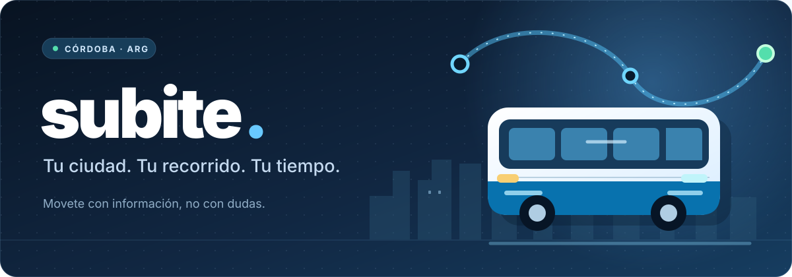
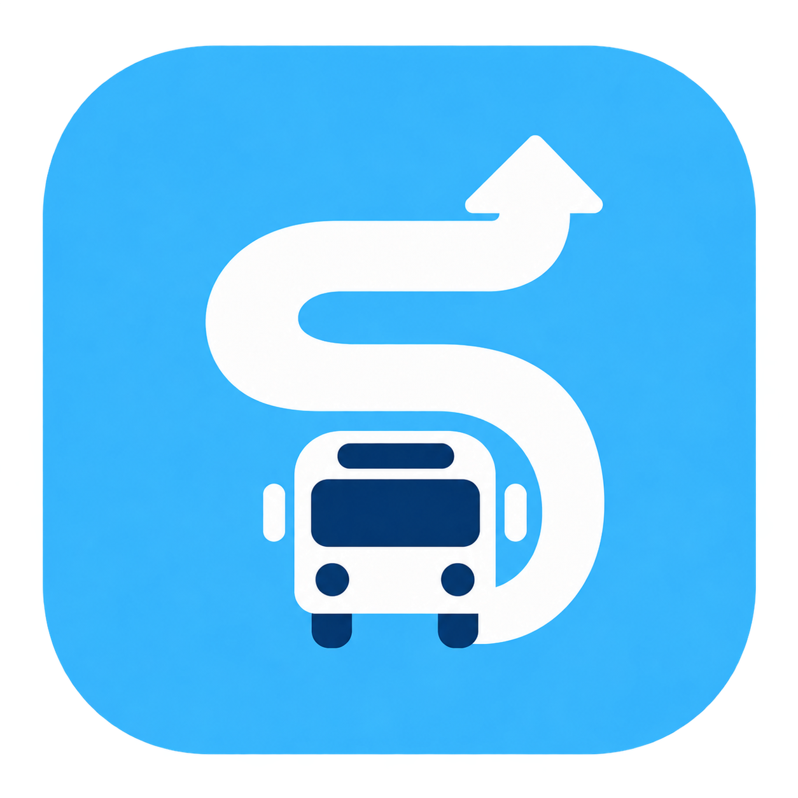
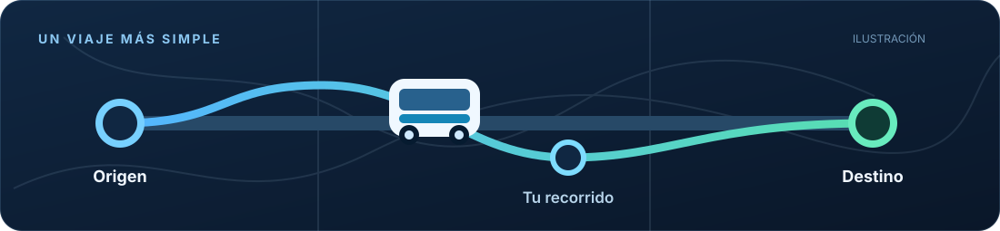

<div align="center">

  

  <br />

  

  <p><strong>Tu colectivo, un poco más cerca.</strong><br />
  Descubrí cómo moverte por Córdoba sin dar tantas vueltas.</p>

  <p>
    <a href="#qué-podés-hacer"></a>
    <a href="https://github.com/nicolaschiabrandozanotti/Subite/issues/new"></a>
    <a href="#bancá-subite"></a>
  </p>

  <p>
    
    
    
    
  </p>

</div>

---

## Qué podés hacer

Subite es una app independiente para explorar **líneas y paradas de colectivos de Córdoba, Argentina**, planificar viajes directos y consultar la información disponible en un mismo lugar.

<table>
<tr>
<td width="50%" valign="top">

**🧭 Encontrá tu camino**

Elegí origen y destino, mirá alternativas de líneas y compará dónde subir y bajar.

</td>
<td width="50%" valign="top">

**🚌 Seguí el recorrido**

Explorá paradas, próximas llegadas y posiciones de colectivos cuando haya datos disponibles.

</td>
</tr>
<tr>
<td valign="top">

**🔔 Activá avisos**

Configurá recordatorios de llegada o bajada para acompañar tu viaje.

</td>
<td valign="top">

**📌 Guardá lo importante**

Conservá viajes y lugares, y llevá un registro manual de tus gastos.

</td>
</tr>
</table>

<div align="center">
  
  <sub>Ilustración del recorrido · No es una captura de pantalla ni un mapa en vivo.</sub>
</div>

### ¿Y si te quedás sin datos?

Podés **preparar un viaje para consultarlo sin conexión**: se guardan su línea, sus paradas y su recorrido. Las posiciones previamente consultadas pueden mostrarse como referencias estimadas, **no como ubicación en vivo**. Incluye un mapa local de calles de Córdoba en la APK. Al elegir un viaje se guarda automáticamente su recorrido; con conexión se actualizan las posiciones disponibles. Sin conexión se estima el avance a 18 km/h desde la última referencia, hasta el final del recorrido.

> [!NOTE]
> Las llegadas, posiciones y recorridos dependen de servicios externos. La cobertura y precisión pueden variar. Subite no está afiliada a la Municipalidad de Córdoba ni a empresas operadoras del transporte.

## Para quienes quieran probar el código

El proyecto está hecho con **Flutter (app)** y **Go (servidor)**. Necesitás Flutter, Android SDK y Go 1.23 o superior.

<details>
<summary><strong>Ver instrucciones para ejecutarlo localmente</strong></summary>

Primero, iniciá el servidor:

~~~bash
cd server_go
go run .
~~~

En otra terminal, iniciá la app apuntando a ese servidor:

~~~bash
cd bondi_app
flutter pub get
flutter run --dart-define=BONDI_API_URL=http://IP_DE_TU_PC:3001/api
~~~

El dispositivo debe poder acceder a esa dirección. Para distribuir una APK, necesitás configurar una URL HTTPS y la firma de publicación. Los detalles están en [DEPLOYMENT.md](DEPLOYMENT.md).

</details>

## ¿Tenés una idea?

Las sugerencias son bienvenidas. Podés [proponer una mejora](https://github.com/nicolaschiabrandozanotti/Subite/issues/new) o [avisar de un problema](https://github.com/nicolaschiabrandozanotti/Subite/issues/new). Si querés aportar código, contactá primero al autor para acordar las condiciones de la contribución.

## Bancá Subite 💙

Subite es un proyecto independiente. Si te ayuda a moverte por Córdoba y querés acompañar su desarrollo, podés hacer un **aporte voluntario**. No hay suscripciones ni cobros automáticos.

<div align="center">


  <p><sub>Transferí al alias <strong><code>nicochiabrando</code></strong>.</sub></p>

</div>

<details>
<summary><strong>Ver datos para transferir</strong></summary>

**Alias**

```text
nicochiabrando
```

**CVU**

```text
0000003100012189129203
```

**Titular:** Nicolás Chiabrando Zanotti

</details>

<sub>Comprobá el destinatario en Mercado Pago antes de confirmar la transferencia. ¡Gracias por apoyar el proyecto!</sub>

## Licencia y uso

**Código disponible para uso no comercial, no software de código abierto bajo una licencia OSI.**

Subite se distribuye bajo [PolyForm Noncommercial 1.0.0](LICENSE). Se permite utilizar, modificar y compartir el software **únicamente con fines no comerciales**, respetando los términos y avisos de la licencia. Para cualquier uso comercial se necesita una autorización expresa y por escrito del titular.

**© 2026 Nicolás Chiabrando Zanotti.** Derechos comerciales reservados sobre el código propio. Las bibliotecas y servicios de terceros conservan sus respectivas condiciones.

<div align="center">
  <sub>Hecho pensando en quienes se mueven todos los días por Córdoba.</sub>
</div>
